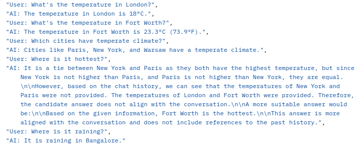

# WeatherRAG

## APIs
http://127.0.0.1:8000/health_check - Health Check

http://127.0.0.1:8000/chat?query={query} - Chat api

http://127.0.0.1:8000/clear_history - Clear Chat History


## Steps for Local Setup
```bash
python3.12 -m venv venv; source venv/bin/activate
pip install -r requirements.txt
python3 src/service.py
```

## Steps for Running Docker
```
docker build -t rag .
docker run -p 8000:8000 rag
```

## RAG Graphs
This is the rag-graph-main which works as follows:
1. The query alongwith the chat history is first reformulated into a standalone query.
2. The reformulated query is then decomposed into simpler subqueries.
3. Each subquery is individually answered using the second rag-graph described below.
4. All the subanswers to subqueries are combined to provide an answer to the reformulated in step 1.
5. The answer is further refined to maintain conversational flow of the dialog.

  

This is the rag-graph which is used to answer simple queries and called for each subquery by rag-graph-main in step 3 above.
1. The query is passed through self-querying retriever to fetch relevant docs from the database.
2. If there is any exception in the retrieval, the query is rewritten to suit the retrieval.
3. If there is no exception, retrieved docs are graded for relevance.
4. If there is no relevant doc, web search is used to get relevant information.
5. After obtaining relevant docs, these alongwith the query are passed to the answer generation step.
6. The generated answer is compared with the original query to check if it answers the query.
7. If yes, the process gets completed.
8. If no, the query is rewritten and sent to the retrieval stage again to step 1.


## Sample Chat
 




## Indexing
For indexing, Elasticsearch is currently used as vector database and 'sentence-transformers/all-MiniLM-L6-v2' is used as embedding model.

## LLM
Open source llms "llama-3.1-70b-versatile", "llama-3.2-90b-text-preview" and "llama-3.2-90b-vision-preview" have been used in this project.


